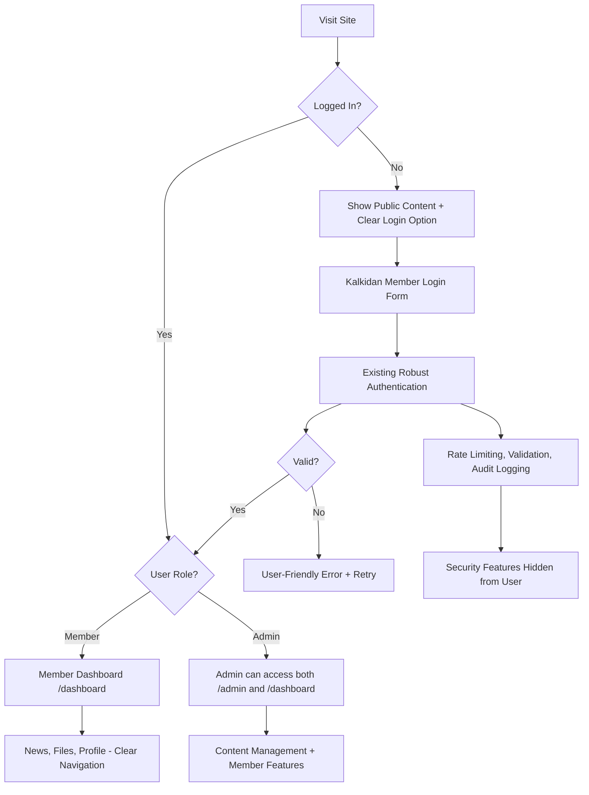

# Design Document

## Overview

This design improves the user experience of the existing robust authentication system for Kalkidan e.V. The current system has excellent security architecture with features like rate limiting, input validation, audit logging, and role-based access control. However, the user interface and user experience need improvements to make the system more accessible to community members. The design maintains all existing security features while creating a more intuitive and user-friendly interface.

## Architecture

### Enhanced User Experience Flow

The core principle is **"robust security with intuitive interface"** - maintain all existing security features while making the user experience smooth and clear.



### Component Architecture

1. **Enhanced Login Component**
   - Update branding from "CMS Login" to "Kalkidan Member Login"
   - Keep existing robust validation but improve error messages
   - Fix redirect logic to go to /dashboard instead of CMS routes
   - Maintain existing security features (rate limiting, input validation)

2. **Improved Member Dashboard**
   - Keep existing dashboard structure but ensure reliable loading
   - Maintain current features: profile, files, news access
   - Fix logout functionality to work consistently
   - Preserve existing security context and session management

3. **Refined Admin Interface**
   - Keep existing admin features and security
   - Maintain role-based access control
   - Improve navigation between admin and member views
   - Preserve audit logging and security monitoring

## Components and Interfaces

### Enhanced Login Component (Keep Existing Security)

```typescript
// Keep existing AuthForm component structure but improve UX
interface AuthFormProps {
  mode: "login" | "register";
}

// Keep existing User interface from current system
interface User {
  id: string;
  email: string;
  name: string;
  role: 'user' | 'admin'; // Keep existing role names
  phone?: string;
  address?: string;
  emailVerified: boolean;
}
```

**UX Improvements:**
- Change "CMS Login" to "Kalkidan Member Login" 
- Keep existing SecurityUtils validation but improve error messages
- Fix redirect logic in onSubmit handler
- Maintain existing rate limiting and security features

### Improved Authentication Context (Keep Robust Features)

```typescript
// Keep existing AuthContextType but improve error handling
interface AuthContextType {
  // Keep all existing properties
  authState: AuthState;
  user: User | null;
  token: string | null;
  isLoading: boolean;
  authError: string | null;
  
  // Keep all existing methods
  login: (email: string, password: string) => Promise<void>;
  register: (data: RegisterData) => Promise<{ userId: string; message: string }>;
  logout: () => Promise<void>;
  verifyRole: (role: 'user' | 'admin') => Promise<boolean>;
  // ... all other existing methods
}
```

**UX Improvements:**
- Keep existing security features (role verification, session management)
- Improve error messages to be more user-friendly
- Fix redirect logic after successful authentication
- Maintain existing audit logging and security monitoring

### Enhanced Route Protection (Keep Security Architecture)

```typescript
// Keep existing ProtectedRoute component but improve UX
interface ProtectedRouteProps {
  children: React.ReactNode;
  requiredRole?: 'user' | 'admin';
  redirectTo?: string;
  fallback?: React.ReactNode;
}
```

**Improvements:**
- Keep existing server-side validation and middleware
- Maintain existing role-based access control
- Improve loading states and error messages
- Keep existing security event logging

## Data Models

### Simple User Model

```typescript
interface User {
  id: string;
  email: string;
  name: string;
  role: 'member' | 'admin';
  phone?: string;
  joinDate: string;
  isActive: boolean;
}
```

### Basic Session Model

```typescript
interface Session {
  token: string;
  userId: string;
  expiresAt: number;
  createdAt: number;
}
```

### Registration Data

```typescript
interface RegisterData {
  name: string;
  email: string;
  password: string;
  phone?: string;
}
```

## Error Handling

### Simple Error Categories

1. **Login Errors**
   - Invalid email or password
   - Account not found
   - Account inactive

2. **Registration Errors**
   - Email already exists
   - Invalid email format
   - Password too weak

3. **Session Errors**
   - Session expired
   - Not logged in

### User-Friendly Error Messages

```typescript
interface ErrorMessage {
  type: 'login' | 'register' | 'session';
  message: string;
  action?: 'retry' | 'redirect_login' | 'contact_admin';
}
```

**Error Handling Approach:**
- Show clear, helpful messages to users
- Avoid technical jargon
- Provide clear next steps
- Log technical details separately for debugging

## Testing Strategy

### Basic Functionality Tests

1. **Login/Registration Tests**
   - Valid login redirects to dashboard
   - Invalid login shows error message
   - Registration creates new account
   - Logout clears session

2. **Navigation Tests**
   - Members see member navigation
   - Admins can access admin features
   - Unauthenticated users see public content
   - Protected routes redirect to login

3. **User Experience Tests**
   - Login form is clear and simple
   - Error messages are helpful
   - Dashboard shows relevant content
   - Navigation is intuitive

### Test Implementation

```typescript
interface BasicTestSuite {
  loginTests: {
    validLogin: () => Promise<void>;
    invalidLogin: () => Promise<void>;
    logout: () => Promise<void>;
  };
  
  navigationTests: {
    memberAccess: () => Promise<void>;
    adminAccess: () => Promise<void>;
    publicAccess: () => Promise<void>;
  };
  
  userExperienceTests: {
    loginFlow: () => Promise<void>;
    registrationFlow: () => Promise<void>;
    dashboardContent: () => Promise<void>;
  };
}
```

## Implementation Phases

### Phase 1: Fix Login Experience (Keep Security)
- Update login page branding from "CMS Login" to "Kalkidan Member Login"
- Fix login redirect logic to go to /dashboard instead of CMS routes
- Improve error messages while keeping existing validation
- Maintain existing rate limiting and security features

### Phase 2: Improve User Interface
- Keep existing dashboard structure but fix loading issues
- Maintain existing admin interface but improve navigation
- Keep existing role-based access control but improve UX
- Fix logout functionality while preserving session security

### Phase 3: Enhance Error Handling
- Keep existing authentication context but improve error messages
- Maintain existing session management but fix user experience issues
- Keep existing security features but make them transparent to users
- Preserve audit logging while improving user feedback

### Phase 4: Testing and Validation
- Keep existing middleware and route protection
- Maintain existing admin role verification
- Test improved UX while ensuring security features still work
- Validate that robust security is maintained with better usability

## Security Approach

### Balanced Security Strategy

1. **Essential Protection**
   - Basic authentication for member areas
   - Simple admin role verification
   - Session management
   - Password protection

2. **User-Friendly Approach**
   - Clear error messages
   - Simple login process
   - Reliable session handling
   - Minimal barriers to use

3. **Community-Appropriate Security**
   - Protect member information
   - Secure admin functions
   - Basic logging for troubleshooting
   - Focus on reliability over advanced security