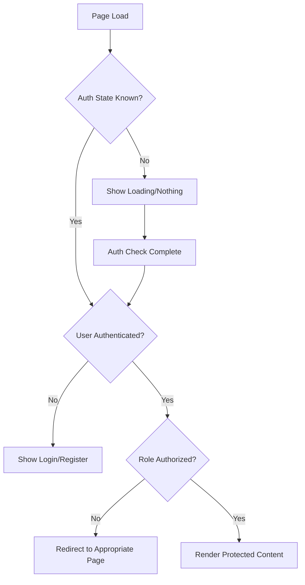

# Design Document

## Overview

This design addresses critical security vulnerabilities in the authentication and authorization system. The current implementation has timing issues where protected UI elements are rendered before authentication checks complete, allowing unauthorized users to see admin interfaces and user data. This design implements a comprehensive security-first approach with proper state management, server-side middleware protection, and fail-safe UI rendering.

## Architecture

### Security-First Rendering Strategy

The core principle is **"secure by default"** - no protected content should ever render until authentication and authorization are explicitly verified. This prevents information leakage during loading states or authentication failures.



### Component Architecture

1. **Enhanced ProtectedRoute Component**
   - Implements strict rendering guards
   - Handles all authentication states explicitly
   - Provides role-based access control
   - Never renders protected content during uncertain states

2. **Secure Navigation Components**
   - AuthNav component with proper state handling
   - Admin layout with enhanced security checks
   - Fallback states for all authentication scenarios

3. **Server-Side Middleware Protection**
   - Route-level authentication verification
   - Token validation and role checking
   - Automatic redirects for unauthorized access
   - Security event logging

## Components and Interfaces

### Enhanced ProtectedRoute Component

```typescript
interface ProtectedRouteProps {
  children: React.ReactNode;
  requiredRole?: 'user' | 'admin';
  redirectTo?: string;
  fallback?: React.ReactNode;
  strictMode?: boolean; // Never render during uncertain states
}

interface AuthState {
  user: User | null;
  isLoading: boolean;
  isAuthenticated: boolean;
  hasRequiredRole: boolean;
  error: string | null;
}
```

**Key Features:**
- Strict mode prevents any rendering during loading states
- Explicit role checking with server-side verification
- Graceful error handling with appropriate fallbacks
- Automatic cleanup of stale authentication data

### Secure Admin Layout

```typescript
interface AdminLayoutState {
  authVerified: boolean;
  roleVerified: boolean;
  isLoading: boolean;
  shouldRedirect: boolean;
  redirectPath: string;
}
```

**Security Measures:**
- Double verification of admin role (client + server)
- Immediate redirect on authorization failure
- No admin UI elements rendered until fully verified
- Session validation on every admin route access

### Enhanced Authentication Context

```typescript
interface SecureAuthContextType {
  user: User | null;
  token: string | null;
  isLoading: boolean;
  isAuthenticated: boolean;
  authError: string | null;
  login: (email: string, password: string) => Promise<void>;
  logout: () => Promise<void>;
  verifyRole: (role: 'user' | 'admin') => Promise<boolean>;
  clearAuthError: () => void;
}
```

**Enhanced Features:**
- Explicit authentication state tracking
- Role verification with server-side validation
- Error state management
- Automatic token refresh handling

### Server-Side Middleware

```typescript
interface MiddlewareConfig {
  protectedRoutes: {
    pattern: string;
    requiredRole: 'user' | 'admin';
    redirectTo: string;
  }[];
  publicRoutes: string[];
  authRoutes: string[];
}
```

**Protection Layers:**
- Route pattern matching for protected areas
- Token validation and expiration checking
- Role-based access control enforcement
- Security event logging and monitoring

## Data Models

### Authentication State Model

```typescript
interface AuthenticationState {
  status: 'loading' | 'authenticated' | 'unauthenticated' | 'error';
  user: User | null;
  token: string | null;
  permissions: string[];
  lastVerified: number;
  error: AuthError | null;
}

interface AuthError {
  code: 'INVALID_TOKEN' | 'EXPIRED_SESSION' | 'INSUFFICIENT_PERMISSIONS' | 'NETWORK_ERROR';
  message: string;
  timestamp: number;
}
```

### Session Security Model

```typescript
interface SecureSession {
  token: string;
  userId: string;
  role: 'user' | 'admin';
  expiresAt: number;
  lastActivity: number;
  ipAddress: string;
  userAgent: string;
  isActive: boolean;
}
```

## Error Handling

### Authentication Error Categories

1. **Network Errors**
   - Connection failures
   - Timeout errors
   - Service unavailable

2. **Authorization Errors**
   - Invalid credentials
   - Expired sessions
   - Insufficient permissions

3. **System Errors**
   - Configuration issues
   - Database connectivity
   - Service dependencies

### Error Recovery Strategies

```typescript
interface ErrorRecoveryStrategy {
  errorType: AuthErrorType;
  retryable: boolean;
  maxRetries: number;
  fallbackAction: 'redirect' | 'show_error' | 'retry' | 'logout';
  userMessage: string;
}
```

**Recovery Actions:**
- Automatic token refresh for expired sessions
- Graceful degradation for network issues
- Clear error messages without exposing system details
- Automatic logout for security violations

## Testing Strategy

### Security Test Categories

1. **Authentication Flow Tests**
   - Login/logout functionality
   - Session management
   - Token validation
   - Password security

2. **Authorization Tests**
   - Role-based access control
   - Route protection
   - UI element visibility
   - API endpoint security

3. **Security Vulnerability Tests**
   - Unauthorized access attempts
   - Session hijacking prevention
   - CSRF protection
   - XSS prevention

4. **State Management Tests**
   - Authentication state transitions
   - Loading state handling
   - Error state management
   - Race condition prevention

### Test Implementation Strategy

```typescript
interface SecurityTestSuite {
  authenticationTests: {
    validLogin: () => Promise<void>;
    invalidCredentials: () => Promise<void>;
    sessionExpiry: () => Promise<void>;
    concurrentSessions: () => Promise<void>;
  };
  
  authorizationTests: {
    adminRouteAccess: () => Promise<void>;
    roleBasedUI: () => Promise<void>;
    unauthorizedRedirect: () => Promise<void>;
    privilegeEscalation: () => Promise<void>;
  };
  
  securityTests: {
    tokenValidation: () => Promise<void>;
    sessionSecurity: () => Promise<void>;
    inputValidation: () => Promise<void>;
    errorHandling: () => Promise<void>;
  };
}
```

## Implementation Phases

### Phase 1: Core Security Infrastructure
- Enhanced ProtectedRoute component
- Secure authentication context
- Server-side middleware protection
- Basic error handling

### Phase 2: UI Security Hardening
- Secure admin layout implementation
- Enhanced navigation components
- Loading state management
- Error boundary implementation

### Phase 3: Advanced Security Features
- Role verification system
- Session management improvements
- Security event logging
- Monitoring and alerting

### Phase 4: Testing and Validation
- Comprehensive security testing
- Penetration testing simulation
- Performance optimization
- Documentation and training

## Security Considerations

### Defense in Depth Strategy

1. **Client-Side Protection**
   - Strict rendering guards
   - State validation
   - Input sanitization
   - Error boundary protection

2. **Server-Side Protection**
   - Route middleware validation
   - Token verification
   - Role-based access control
   - Rate limiting

3. **Network Protection**
   - HTTPS enforcement
   - CSRF protection
   - Security headers
   - Content Security Policy

### Monitoring and Alerting

```typescript
interface SecurityMonitoring {
  events: {
    unauthorizedAccess: SecurityEvent;
    authenticationFailure: SecurityEvent;
    privilegeEscalation: SecurityEvent;
    suspiciousActivity: SecurityEvent;
  };
  
  alerts: {
    threshold: number;
    timeWindow: number;
    action: 'log' | 'alert' | 'block';
  };
}
```

**Monitoring Points:**
- Failed authentication attempts
- Unauthorized route access
- Role escalation attempts
- Suspicious user behavior patterns