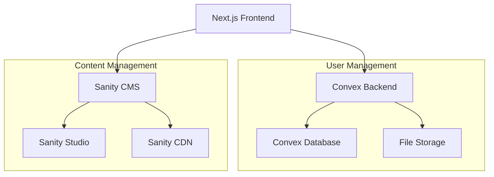

# Design Document

## Overview

This design implements a headless CMS solution using Convex as the backend database and authentication system, integrated with Sanity CMS for content management. The architecture separates user management and file operations (Convex) from content management (Sanity), providing a clean, scalable, and migration-friendly solution.

## Architecture

### High-Level Architecture



### Technology Stack

**Frontend:**
- Next.js 14 with App Router
- TypeScript for type safety
- Tailwind CSS for styling
- React Hook Form for form management

**Backend (Convex):**
- Convex for database and real-time functionality
- Convex Auth for user authentication
- Convex File Storage for user uploads

**Content Management (Sanity):**
- Sanity Studio for admin interface
- Sanity CDN for optimized content delivery
- Portable Text for rich content

**Integration:**
- Sanity Client for fetching published content
- Convex React hooks for real-time data
- Next.js API routes for webhook handling

## Components and Interfaces

### Authentication System

**Convex Auth Integration:**
```typescript
// User schema in Convex
export const users = defineTable({
  email: v.string(),
  name: v.string(),
  role: v.union(v.literal("user"), v.literal("admin")),
  createdAt: v.number(),
  lastLogin: v.optional(v.number()),
}).index("by_email", ["email"]);
```

**Authentication Flow:**
1. User registers/logs in through Next.js frontend
2. Convex Auth handles authentication and session management
3. User role determines access to different areas
4. JWT tokens manage session state

### File Management System

**File Storage Schema:**
```typescript
export const files = defineTable({
  userId: v.id("users"),
  fileName: v.string(),
  fileType: v.string(),
  fileSize: v.number(),
  storageId: v.id("_storage"),
  uploadedAt: v.number(),
  isPublic: v.boolean(),
}).index("by_user", ["userId"]);
```

**File Operations:**
- Upload: Validate → Store in Convex → Create database record
- Download: Verify permissions → Generate secure URL
- Delete: Remove from storage → Update database

### Content Management Integration

**Sanity Schema Structure:**
```javascript
// News article schema
export default {
  name: 'article',
  title: 'Article',
  type: 'document',
  fields: [
    {
      name: 'title',
      title: 'Title',
      type: 'string',
      validation: Rule => Rule.required()
    },
    {
      name: 'slug',
      title: 'Slug',
      type: 'slug',
      options: { source: 'title' }
    },
    {
      name: 'content',
      title: 'Content',
      type: 'array',
      of: [{ type: 'block' }]
    },
    {
      name: 'featuredImage',
      title: 'Featured Image',
      type: 'image'
    },
    {
      name: 'publishedAt',
      title: 'Published At',
      type: 'datetime'
    }
  ]
}
```

**Content Fetching Strategy:**
- Static Generation (SSG) for published articles
- Incremental Static Regeneration (ISR) for updates
- Real-time updates using Sanity webhooks

## Data Models

### User Management (Convex)

**Users Table:**
- `id`: Unique identifier
- `email`: User email (indexed)
- `name`: Display name
- `role`: User role (user/admin)
- `createdAt`: Registration timestamp
- `lastLogin`: Last login timestamp

**Files Table:**
- `id`: Unique identifier
- `userId`: Reference to user
- `fileName`: Original file name
- `fileType`: MIME type
- `fileSize`: File size in bytes
- `storageId`: Convex storage reference
- `uploadedAt`: Upload timestamp
- `isPublic`: Public access flag

**Sessions Table:**
- `id`: Session identifier
- `userId`: Reference to user
- `createdAt`: Session creation time
- `expiresAt`: Session expiration time

### Content Management (Sanity)

**Article Schema:**
- `title`: Article title
- `slug`: URL-friendly identifier
- `content`: Rich text content (Portable Text)
- `featuredImage`: Main article image
- `publishedAt`: Publication date
- `author`: Article author reference
- `categories`: Article categories

**Media Schema:**
- `title`: Media title
- `description`: Media description
- `file`: File reference
- `altText`: Accessibility text
- `tags`: Media tags for organization

## Error Handling

### Authentication Errors
- Invalid credentials: Clear error messages
- Session expiration: Automatic redirect to login
- Permission denied: 403 status with explanation
- Rate limiting: Temporary lockout with retry information

### File Upload Errors
- File size exceeded: Clear size limit information
- Invalid file type: List of accepted formats
- Storage quota exceeded: Upgrade path information
- Network errors: Retry mechanism with exponential backoff

### Content Management Errors
- Sanity API failures: Fallback to cached content
- Webhook failures: Retry mechanism with dead letter queue
- Content validation errors: Clear field-specific messages
- Publishing errors: Draft preservation with error logging

### Database Errors
- Connection failures: Automatic retry with circuit breaker
- Query timeouts: Optimized query suggestions
- Data validation errors: Field-specific error messages
- Concurrent modification: Optimistic locking with conflict resolution

## Testing Strategy

### Unit Testing
- Convex functions testing with mock data
- React component testing with React Testing Library
- Utility function testing with Jest
- Form validation testing with various input scenarios

### Integration Testing
- Authentication flow end-to-end testing
- File upload/download workflow testing
- Content publishing and display testing
- User permission and role testing

### Performance Testing
- File upload performance with various sizes
- Content loading performance optimization
- Database query performance monitoring
- CDN cache effectiveness testing

### Security Testing
- Authentication bypass attempt testing
- File access permission testing
- SQL injection and XSS prevention testing
- Rate limiting effectiveness testing

## Deployment and Infrastructure

### Development Environment
- Local Convex development server
- Local Sanity Studio instance
- Next.js development server with hot reload
- Environment variable management for API keys

### Production Environment
- Convex production deployment
- Sanity Studio hosted deployment
- Next.js deployment on Vercel/Netlify
- CDN configuration for optimal performance

### Monitoring and Logging
- Convex function execution monitoring
- File upload/download analytics
- Content management activity logging
- Error tracking and alerting system

### Backup and Recovery
- Convex automatic database backups
- Sanity content export procedures
- File storage redundancy planning
- Disaster recovery documentation